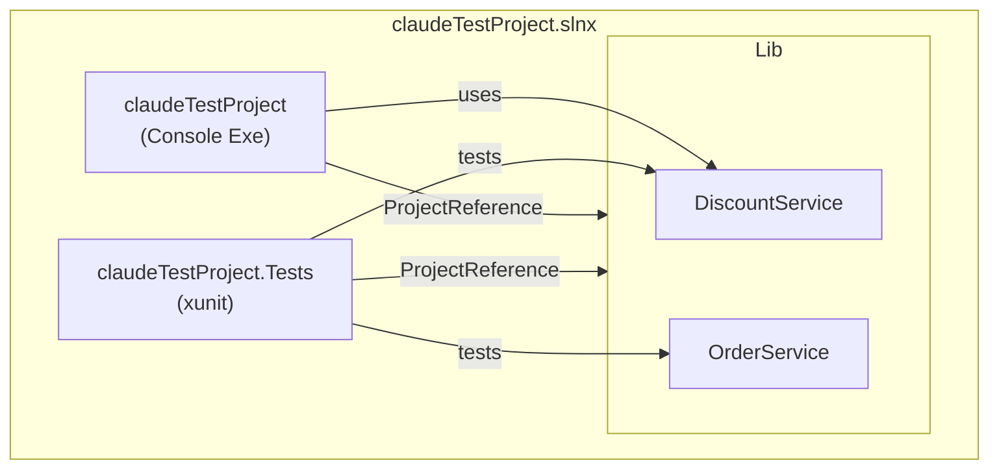
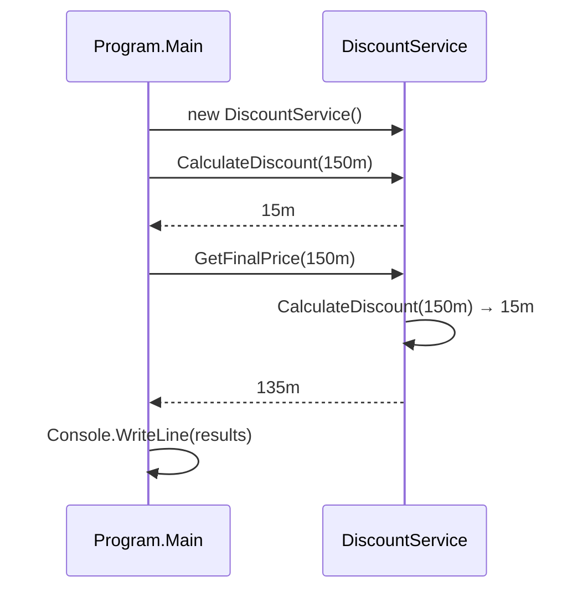
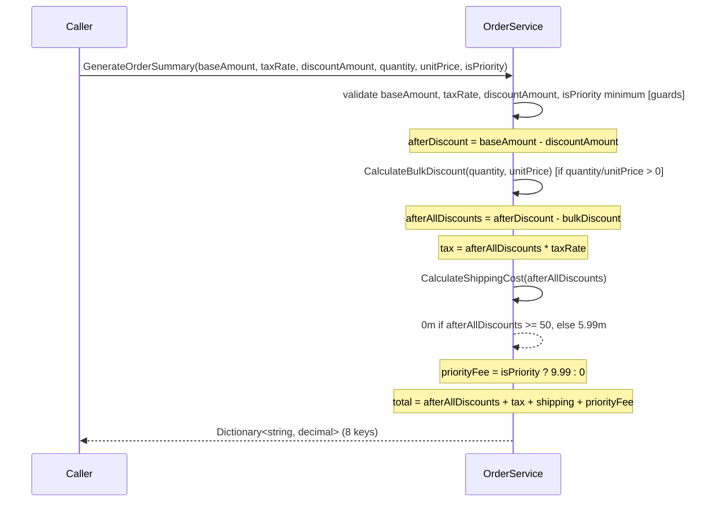

# Codebase Map

> Last updated: 2026-05-08T10:30:00Z

## System Overview

A three-project .NET 10 solution implementing a simple e-commerce order-processing library (`CommonServices`), a console app that demonstrates it (`claudeTestProject`), and an xunit test suite (`claudeTestProject.Tests`). All business logic lives in the class library; the console app and tests consume it independently.



---

## Directory Structure

```
claudeTestProject/
├── .claude/
│   ├── CLAUDE.md               # Project instructions for Claude Code
│   └── settings.json           # Enables the cartographer plugin
├── .github/
│   └── workflows/
│       ├── ci.yml                          # Automated build + test on push/PR to master
│       ├── claude.yml_disabled             # Claude Code assistant (disabled)
│       └── claude-code-review.yml_disabled # Automated PR code review (disabled)
├── CommonServices/             # Class library — all business logic
│   ├── CommonServices.csproj
│   ├── DiscountService.cs      # 10% discount for orders > $100 (validates positive input)
│   └── OrderService.cs         # Tax, shipping, status, delivery, bulk discount, priority fee
├── claudeTestProject.Tests/    # xunit test project
│   ├── claudeTestProject.Tests.csproj
│   ├── DiscountServiceTests.cs # 12 tests for DiscountService
│   └── OrderServiceTests.cs    # 56 tests for OrderService (#region-grouped)
├── claudeTestProject.csproj    # Console app project file
├── claudeTestProject.slnx      # Solution file (.slnx XML format, .NET 9+)
├── Program.cs                  # Console entry point — demos DiscountService only
└── .gitignore
```

---

## Module Guide

### CommonServices (Class Library)

**Purpose:** All business logic. Referenced by both the console app and the test project.
**Entry point:** `CommonServices.csproj`
**Key files:**

| File | Purpose |
|------|---------|
| `DiscountService.cs` | 10% discount logic for qualifying orders; validates positive input |
| `OrderService.cs` | Tax, shipping, status, delivery, bulk discount, priority fee, order summary |
| `CommonServices.csproj` | Library project file (no external NuGet deps) |

**Exports:**

`DiscountService`:
```csharp
public decimal CalculateDiscount(decimal orderAmount)
// Returns 10% of orderAmount if orderAmount > 100, else 0.
// Throws ArgumentException if orderAmount <= 0.

public decimal GetFinalPrice(decimal orderAmount)
// Returns orderAmount - CalculateDiscount(orderAmount).
// Throws ArgumentException if orderAmount <= 0 (via CalculateDiscount).
```

`OrderService`:
```csharp
public bool IsValidOrderAmount(decimal orderAmount)
// true if orderAmount > 0.

public decimal CalculateTotalWithTax(decimal baseAmount, decimal taxRate)
// baseAmount + (baseAmount * taxRate). Throws ArgumentException if baseAmount <= 0,
// taxRate < 0, or taxRate > 1.

public decimal CalculateShippingCost(decimal orderAmount)
// 0m if orderAmount >= 50, else 5.99m. Throws ArgumentException if orderAmount <= 0.

public string GetOrderStatus(int stage, bool isPriority = false)
// 1="Pending", 2="Processing" (or "Urgent Processing" if isPriority),
// 3="Shipped", 4="Delivered", _="Unknown". Never throws.

public int GetEstimatedDeliveryDays(string shippingMethod)
// "standard"=5, "express"=2, "overnight"=1 (case-insensitive, whitespace-trimmed).
// Throws ArgumentException for null/whitespace or unknown method.

public decimal CalculateBulkDiscount(int quantity, decimal unitPrice)
// Returns quantity * unitPrice * 0.10 if quantity >= 3, else 0.
// Throws ArgumentException if quantity <= 0 or unitPrice <= 0.

public Dictionary<string, decimal> GenerateOrderSummary(
    decimal baseAmount, decimal taxRate, decimal discountAmount = 0,
    int quantity = 0, decimal unitPrice = 0m, bool isPriority = false)
// Returns dict with 8 keys: "Subtotal", "Discount", "Subtotal After Discount",
// "Bulk Discount", "Tax", "Shipping", "Priority Fee", "Total".
// Throws ArgumentException if:
//   - baseAmount <= 0
//   - taxRate < 0 or taxRate > 1
//   - discountAmount < 0 or discountAmount > baseAmount
//   - isPriority && baseAmount < 20
//   - bulk discount exceeds post-discount subtotal
```

**Dependencies:** No external NuGet packages; `System.Collections.Generic` via implicit usings.

**Dependents:** `claudeTestProject` (console app), `claudeTestProject.Tests` (tests).

---

### claudeTestProject (Console App)

**Purpose:** Executable entry point that demonstrates `DiscountService` with a hardcoded $150 order.
**Entry point:** `Program.cs`
**Key files:**

| File | Purpose |
|------|---------|
| `Program.cs` | Calls DiscountService and prints results |
| `claudeTestProject.csproj` | Exe project file; references CommonServices |

**Dependencies:** `CommonServices` via project reference.

**Gotchas:** Only `DiscountService` is exercised; `OrderService` is never called from the console app.

---

### claudeTestProject.Tests (xunit Test Project)

**Purpose:** Full test suite for all `CommonServices` business logic.
**Key files:**

| File | Purpose |
|------|---------|
| `DiscountServiceTests.cs` | 12 tests for DiscountService |
| `OrderServiceTests.cs` | 56 tests for OrderService, grouped by #region |
| `claudeTestProject.Tests.csproj` | Test project file; xunit + test SDK |

**Test packages:** `xunit` v2.9.3, `Microsoft.NET.Test.Sdk` v17.10.0, `xunit.runner.visualstudio` v2.5.8.

**Dependencies:** `CommonServices` via project reference (does NOT reference the console app).

**Patterns:** Arrange-Act-Assert, `[Theory]` + `[InlineData]` for parameterized cases, `#region` grouping by method under test.

---

### CI/CD Workflows

| Workflow | Trigger | Action |
|---|---|---|
| `ci.yml` | Push or PR to `master` | `dotnet build` + `dotnet test` — blocks merges on failure |
| `claude.yml_disabled` | *(disabled)* | Claude Code assistant (triggered by `@claude` mention) |
| `claude-code-review.yml_disabled` | *(disabled)* | Automated PR code review via `code-review` plugin |

---

## Data Flow

### Console App Path



### Order Summary Flow (Library)



---

## Conventions

- **Naming:** Classes and methods PascalCase; parameters camelCase; private fields `_camelCase`.
- **Validation:** All public methods throw `ArgumentException` on invalid input. `GetOrderStatus` never throws (returns `"Unknown"` for unrecognised stages).
- **Documentation:** XML doc comments on all public methods.
- **Tests:** Arrange-Act-Assert; `[Theory]` + `[InlineData]` for parameterized cases; `#region` to group tests by method.
- **Commits:** Conventional commits (`feat`, `fix`, `test`, `docs`, `refactor`).

---

## Gotchas

| Area | Gotcha |
|---|---|
| `DiscountService` | Threshold is **strictly greater than** `$100` — an order of exactly `$100.00` gets **zero discount**. |
| `OrderService.GenerateOrderSummary` | Tax is computed on the **post-discount** subtotal, not the original base amount. |
| `OrderService.GenerateOrderSummary` | Shipping uses the **post-all-discounts** amount — discounts can push the order under $50 and trigger the $5.99 charge. |
| `OrderService.GenerateOrderSummary` | Bulk discount requires **both** `quantity` and `unitPrice` — passing one without the other throws `ArgumentException`. Omitting both (defaults) silently skips the discount. |
| `OrderService.GenerateOrderSummary` | Priority fee is added **after** tax and shipping are calculated — it does not affect the taxable base. |
| `OrderService.GetOrderStatus` | Accepts any `int` (including negative); returns `"Unknown"` without throwing. |
| `claudeTestProject.slnx` | Tooling that only scans for `.sln` may not detect the `.slnx` solution file. |
| `Program.cs` | `OrderService` is never demonstrated in the console app — only `DiscountService`. |

---

## Test Coverage

| Method | Tests | Notes |
|--------|-------|-------|
| `DiscountService.CalculateDiscount` | 8 | Includes zero/negative input validation |
| `DiscountService.GetFinalPrice` | 4 | Includes zero/negative input validation |
| `OrderService.IsValidOrderAmount` | 3 | Full coverage |
| `OrderService.CalculateTotalWithTax` | 7 | Full coverage including taxRate bounds |
| `OrderService.CalculateShippingCost` | 5 | Negative amount untested |
| `OrderService.GetOrderStatus` | 9 | Includes priority/non-priority at stage 2 |
| `OrderService.GetEstimatedDeliveryDays` | 9 | Includes whitespace-padded inputs |
| `OrderService.CalculateBulkDiscount` | 6 | Full coverage |
| `OrderService.GenerateOrderSummary` | 14 | Includes taxRate, bulk discount, and priority fee cases |
| `Program.Main` | 0 | Console app has no tests |

**Total: 68 tests, all passing.**

---

## Navigation Guide

**To add a new business rule / service method:**
1. Edit `CommonServices/OrderService.cs` or `CommonServices/DiscountService.cs`
2. Add XML doc comment and `ArgumentException` validation
3. Add tests in `claudeTestProject.Tests/OrderServiceTests.cs` (or `DiscountServiceTests.cs`) under a new `#region`

**To add a new service class:**
1. Create `CommonServices/NewService.cs`
2. Add tests in `claudeTestProject.Tests/NewServiceTests.cs`
3. Reference from `Program.cs` if demonstration is needed

**To run the console app:**
```bash
dotnet run --project claudeTestProject.csproj
```

**To run all tests:**
```bash
dotnet test claudeTestProject.Tests/
```

**To run a single test:**
```bash
dotnet test claudeTestProject.Tests/ --filter "FullyQualifiedName~MethodName"
```

**To trigger CI:** Push to or open a PR against `master` — `ci.yml` runs `dotnet build` + `dotnet test` automatically.
