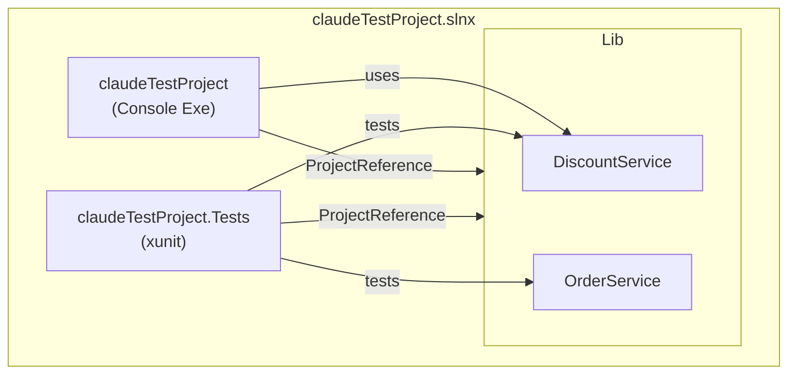
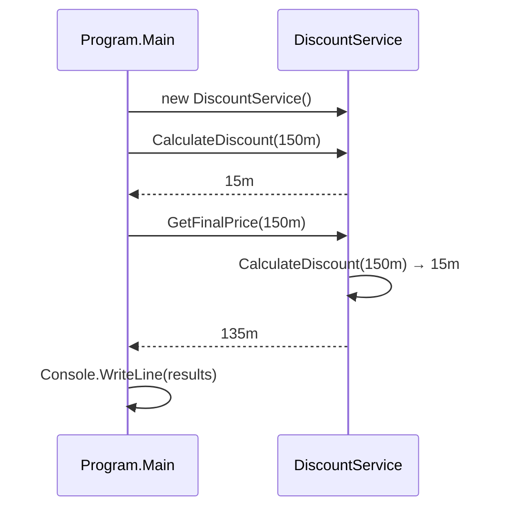
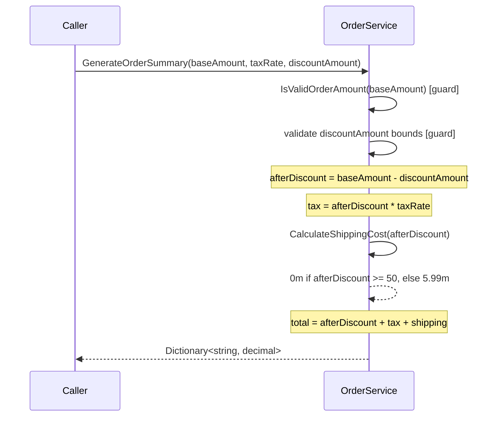

# Codebase Map

> Auto-generated by Cartographer. Last mapped: 2026-05-07T11:12:00Z

## System Overview

A three-project .NET 10 solution implementing a simple e-commerce order-processing library (`CommonServices`), a console app that demonstrates it (`claudeTestProject`), and an xunit test suite (`claudeTestProject.Tests`). All business logic lives in the class library; the console app and tests consume it independently.



---

## Directory Structure

```
claudeTestProject/
├── .claude/
│   ├── CLAUDE.md               # Project instructions for Claude Code
│   └── settings.json           # Enables the cartographer plugin
├── .github/
│   └── workflows/
│       ├── claude.yml              # Claude Code assistant (triggered by @claude mention)
│       └── claude-code-review.yml  # Automated PR code review via Claude
├── CommonServices/             # Class library — all business logic
│   ├── CommonServices.csproj
│   ├── DiscountService.cs      # 10% discount for orders > $100
│   └── OrderService.cs         # Tax, shipping, status, delivery, order summary
├── claudeTestProject.Tests/    # xunit test project
│   ├── claudeTestProject.Tests.csproj
│   ├── DiscountServiceTests.cs # 8 tests for DiscountService
│   └── OrderServiceTests.cs    # 27 tests for OrderService (#region-grouped)
├── claudeTestProject.csproj    # Console app project file
├── claudeTestProject.slnx      # Solution file (.slnx XML format, .NET 9+)
├── Program.cs                  # Console entry point — demos DiscountService only
└── .gitignore
```

---

## Module Guide

### CommonServices (Class Library)

**Purpose:** All business logic. Referenced by both the console app and the test project.
**Entry point:** `CommonServices.csproj`
**Key files:**

| File | Purpose | Tokens |
|------|---------|--------|
| `DiscountService.cs` | 10% discount logic for qualifying orders | 216 |
| `OrderService.cs` | Tax, shipping, status, delivery, and order summary | 956 |
| `CommonServices.csproj` | Library project file (no external NuGet deps) | 55 |

**Exports:**

`DiscountService`:
```csharp
public decimal CalculateDiscount(decimal orderAmount)
// Returns 10% of orderAmount if orderAmount > 100, else 0.

public decimal GetFinalPrice(decimal orderAmount)
// Returns orderAmount - CalculateDiscount(orderAmount).
```

`OrderService`:
```csharp
public bool IsValidOrderAmount(decimal orderAmount)
// true if orderAmount > 0.

public decimal CalculateTotalWithTax(decimal baseAmount, decimal taxRate)
// baseAmount + (baseAmount * taxRate). Throws ArgumentException if baseAmount <= 0,
// taxRate < 0, or taxRate > 1.

public decimal CalculateShippingCost(decimal orderAmount)
// 0m if orderAmount >= 50, else 5.99m. Throws ArgumentException if orderAmount <= 0.

public string GetOrderStatus(int stage)
// 1="Pending", 2="Processing", 3="Shipped", 4="Delivered", _="Unknown". Never throws.

public int GetEstimatedDeliveryDays(string shippingMethod)
// "standard"=5, "express"=2, "overnight"=1 (case-insensitive).
// Throws ArgumentException for null/whitespace or unknown method.

public Dictionary<string, decimal> GenerateOrderSummary(
    decimal baseAmount, decimal taxRate, decimal discountAmount = 0)
// Returns dict with keys: "Subtotal", "Discount", "Subtotal After Discount",
// "Tax", "Shipping", "Total".
// Throws ArgumentException if baseAmount <= 0, discountAmount < 0,
// or discountAmount > baseAmount.
```

**Dependencies:** No external NuGet packages; `System.Collections.Generic` via implicit usings.

**Dependents:** `claudeTestProject` (console app), `claudeTestProject.Tests` (tests).

---

### claudeTestProject (Console App)

**Purpose:** Executable entry point that demonstrates `DiscountService` with a hardcoded $150 order.
**Entry point:** `Program.cs`
**Key files:**

| File | Purpose | Tokens |
|------|---------|--------|
| `Program.cs` | Calls DiscountService and prints results | 116 |
| `claudeTestProject.csproj` | Exe project file; references CommonServices | 189 |

**Dependencies:** `CommonServices` via project reference.

**Gotchas:** Only `DiscountService` is exercised; `OrderService` is never called from the console app.

---

### claudeTestProject.Tests (xunit Test Project)

**Purpose:** Full test suite for all `CommonServices` business logic.
**Key files:**

| File | Purpose | Tokens |
|------|---------|--------|
| `DiscountServiceTests.cs` | 8 tests for DiscountService | 532 |
| `OrderServiceTests.cs` | 27 tests for OrderService, grouped by #region | 2526 |
| `claudeTestProject.Tests.csproj` | Test project file; xunit + test SDK | 199 |

**Test packages:** `xunit` v2.9.3, `Microsoft.NET.Test.Sdk` v17.10.0, `xunit.runner.visualstudio` v2.5.8.

**Dependencies:** `CommonServices` via project reference (does NOT reference the console app).

**Patterns:** Arrange-Act-Assert, `[Theory]` + `[InlineData]` for parameterized cases, `#region` grouping by method under test.

---

### CI/CD Workflows

| Workflow | Trigger | Action |
|---|---|---|
| `claude.yml` | `@claude` mentioned in issue/PR | Claude Code assistant fulfills the request |
| `claude-code-review.yml` | PR opened / updated / reopened | Automated code review via `code-review` plugin |

**Note:** There is no automated `dotnet build` / `dotnet test` CI pipeline — all CI is Claude-powered review only. Build and tests must be run manually.

---

## Data Flow

### Console App Path



### Order Summary Flow (Library)



---

## Conventions

- **Naming:** Classes and methods PascalCase; parameters camelCase; private fields `_camelCase`.
- **Validation:** All public methods (except `GetOrderStatus`) throw `ArgumentException` on invalid input.
- **Documentation:** XML doc comments on all public methods.
- **Tests:** Arrange-Act-Assert; `[Theory]` + `[InlineData]` for parameterized cases; `#region` to group tests by method.
- **Commits:** Conventional commits (`feat`, `fix`, `test`, `docs`, `refactor`).

---

## Gotchas

| Area | Gotcha |
|---|---|
| `DiscountService` | Threshold is **strictly greater than** `$100` — an order of exactly `$100.00` gets **zero discount**. |
| `DiscountService` | No validation on negative/zero input — silently returns `0m`. |
| `OrderService.GenerateOrderSummary` | Tax is computed on the **post-discount** subtotal, not the original base amount. |
| `OrderService.GenerateOrderSummary` | Shipping uses the **post-discount** amount — a discount can push the order under $50 and trigger the $5.99 charge. |
| `OrderService.GenerateOrderSummary` | `taxRate` is **not validated** (no bounds check). Passing a negative or >1 rate silently produces an incorrect total. |
| `OrderService.GetEstimatedDeliveryDays` | Case-insensitive but does **not** strip whitespace — `" standard"` throws `ArgumentException`. |
| `OrderService.GetOrderStatus` | Accepts any `int` (including negative); returns `"Unknown"` without throwing. |
| `claudeTestProject.slnx` | `CLAUDE.md` says "no solution file" but a `.slnx` file exists. Tooling that only scans for `.sln` may not detect it. |
| `Program.cs` | `OrderService` is never demonstrated in the console app — only `DiscountService`. |
| CI | No automated build/test pipeline — only Claude-assisted code review. |

---

## Test Coverage

| Method | Tested | Notable Gaps |
|--------|--------|-------------|
| `DiscountService.CalculateDiscount` | Yes (6 cases) | Zero/negative input untested |
| `DiscountService.GetFinalPrice` | Yes (2 cases) | Zero/negative input untested |
| `OrderService.IsValidOrderAmount` | Yes (3 cases) | Full coverage |
| `OrderService.CalculateTotalWithTax` | Yes (6 cases) | Full coverage |
| `OrderService.CalculateShippingCost` | Yes (5 cases) | Negative amount untested |
| `OrderService.GetOrderStatus` | Yes (6 cases) | Full coverage |
| `OrderService.GetEstimatedDeliveryDays` | Yes (6 cases) | Whitespace-only input untested |
| `OrderService.GenerateOrderSummary` | Yes (7 cases) | Invalid `taxRate` neither guarded nor tested |
| `Program.Main` | No | Console app has no tests |

---

## Navigation Guide

**To add a new business rule / service method:**
1. Edit `CommonServices/OrderService.cs` or `CommonServices/DiscountService.cs`
2. Add XML doc comment and `ArgumentException` validation
3. Add tests in `claudeTestProject.Tests/OrderServiceTests.cs` (or `DiscountServiceTests.cs`) under a new `#region`

**To add a new service class:**
1. Create `CommonServices/NewService.cs`
2. Add tests in `claudeTestProject.Tests/NewServiceTests.cs`
3. Reference from `Program.cs` if demonstration is needed

**To run the console app:**
```bash
dotnet run --project claudeTestProject.csproj
```

**To run all tests:**
```bash
dotnet test claudeTestProject.Tests/
```

**To run a single test:**
```bash
dotnet test claudeTestProject.Tests/ --filter "FullyQualifiedName~MethodName"
```

**To trigger Claude Code assistant:** Mention `@claude` in any GitHub issue or PR comment.

**To trigger automated code review:** Open or update a pull request.
